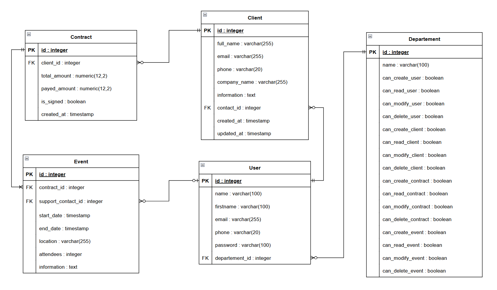
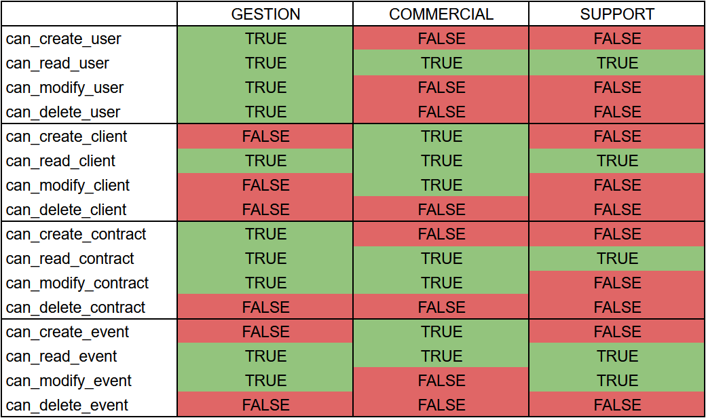

# OC-P12

This program is a CRM-like application that allows you to manage clients, contracts, events, and collaborators within a company.
It includes role-based permissions and activity logging using Sentry.

## Requirements

- Python 3.x
- pip
- PostgreSQL

## Setup

### 1. Clone the repository

Open your terminal and clone the project repository using the following command:

    git clone https://github.com/QuentinSab/OC-P12

Change into the project directory:

    cd OC-P12

### 2. Create a virtual environment

To create a virtual environment with venv:

    python -m venv env

### 3. Activate the virtual environment

To activate the virtual environment, use:

On Windows:

    env\Scripts\activate

On macOS/Linux:

    source env/bin/activate

### 4. Install dependencies

With the virtual environment activated, install the required packages listed in requirements.txt using the following command:

    pip install -r requirements.txt

### 5. Configure environment variables

Create a ".env" file at the root of the project:

    DB_USER=username*
    DB_PASSWORD=password*
    DB_HOST=localhost
    DB_PORT=5432
    DB_NAME=database_name*
    SENTRY_DSN=

### 6. Database setup

Start PostgreSQL, then create a database with:

    CREATE DATABASE database_name*;

And create tables in the terminal with:

    python -m scripts.init_db

Finally, create data in the terminal with:

    python -m scripts.init_data

### 7. Connect Sentry (optional)

To activate Sentry:

1. Create a new Python project in your Sentry account.
2. Add the DSN provided by Sentry to your ".env" file:

    SENTRY_DSN=sentry_dsn

## Usage

### 1. Running the program

Run main.py to start the program:

    python -m main

### 2. Using the program

You can log in using the following account:

    - Email: "user@mail.com"
    - Password: "password"

This user is automatically created when running the initialization script ("init_data.py") and belongs to the "GESTION" department.

### Permissions

